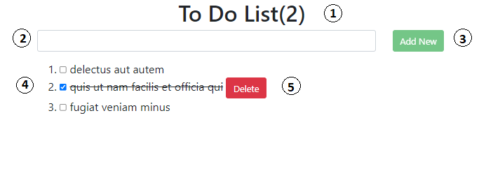

# To-Do-List



## Demo Link
```
https://hsumonlynn.github.io/todoVue/index.html

```


- [To-Do-List](#to-do-list)
  - [Demo Link](#demo-link)
  - [To Do Total List](#to-do-total-list)
  - [Text Input Field](#text-input-field)
  - [Add New Button](#add-new-button)
  - [Check Box](#check-box)
  - [Delete Button](#delete-button)

## To Do Total List

This is total list to do.

## Text Input Field

This is the text field to fill your task.

## Add New Button

The button is to add new task and store to localstorage.

## Check Box

This check-box is checked and label is line through if the task is done.

## Delete Button

This button is to delete the task.